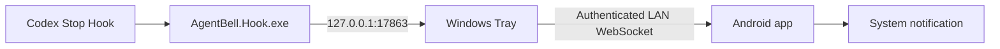

# AgentBell

[English](README.en.md)

AgentBell 在 Codex 当前回合结束后，通过可信局域网把完成通知从 Windows 电脑发送到 Android 系统通知栏。

> 当前版本：`v0.5.0-beta.1` Public Beta（预发布）。协议版本仍为 1。

## 功能

- 用户级 Codex `Stop` Hook，不覆盖现有 `notify`。
- 轻量 Windows Tray、本机回环入口与 LAN WebSocket。
- Android heads-up 通知、自动重连、resume 和事件去重。
- 无账号、无云服务、无遥测、无广告 SDK。
- 默认脱敏日志；不记录 Prompt、完整回复、完整路径、原始会话/回合 ID 或配对 Token。



## 安装

1. 从该版本的 GitHub Pre-release 下载 `AgentBell-Setup-0.5.0-beta.1.exe`、`AgentBell-Android-0.5.0-beta.1.apk` 和 `SHA256SUMS.txt`。
2. 在 PowerShell 中分别对 Setup 和 APK 执行 `Get-FileHash -Algorithm SHA256`，并与 `SHA256SUMS.txt` 比较。
3. 运行 Windows Setup。若本 beta 未使用可信 Authenticode 证书，SmartScreen 可能显示警告；请只在哈希与本仓库发布页一致时继续。
4. Codex 首次发现 AgentBell Stop Hook 时，核对命令指向 Windows LocalAppData Known Folder 下 `Programs\AgentBell\AgentBell.Hook.exe --codex-stop-hook` 的实际路径，再手工信任。安装器不会改写或接管已有 `notify`。
5. 在 Android 上安装 release APK。若设备已装 debug 签名版本，通常必须先卸载；这会删除手机端配对信息。
6. 打开 Tray 配对页，用 Android App 扫描二维码并授予通知权限。
7. Xiaomi/Redmi/HyperOS 建议允许后台活动、自启动（如果系统提供）并把电池策略设为“不限制”。AgentBell 不绕过系统策略。

Android 后续升级必须继续使用同一长期 release 密钥。丢失密钥后，无法以同一包名覆盖安装更新。

## 升级与卸载

覆盖运行新版 Setup 可保留 Windows 配置和事件历史。Android release APK 仅能由同一签名密钥覆盖升级。Windows 卸载默认保留 LocalAppData Known Folder 下的 `AgentBell` 数据；卸载界面可选择一并删除。Android 数据可通过系统“清除存储”或卸载删除。

## 安全与隐私

本机 Hook 入口仅绑定 `127.0.0.1:17863`。手机连接只接受 RFC1918 IPv4，并要求 256-bit 随机 Token；Token 存于 Windows DPAPI 和 Android Keystore 保护的本地状态。第一版使用可信局域网内的 HTTP/WS，**不是 TLS，也不是端到端加密**。不要在公共、访客或不可信网络使用，不要公开二维码或配对 URL。

详见 [SECURITY.md](SECURITY.md)、[PRIVACY.md](PRIVACY.md) 和 [威胁模型](docs/THREAT_MODEL.md)。

## 已知限制

- 仅支持 Windows 10/11 x64、Android 和 Codex。
- 只表示一个 Codex 回合已结束，不表示整个开发任务完成，也不提供真实进度百分比。
- 无云中继；电脑与手机必须位于同一可信局域网。
- Windows unsigned beta 可能触发 SmartScreen；哈希和 GitHub provenance 不能替代 Authenticode。
- Android 厂商可能限制后台服务，尤其是 HyperOS 等深度定制系统。

## 从源码构建

需要 .NET 10 SDK、JDK 17、Android SDK 36 和 Gradle Wrapper。公开 Android release 还需要仓库外的长期签名密钥；参见 [贡献指南](CONTRIBUTING.md) 与 [M5 发布清单](docs/M5_RELEASE_CHECKLIST.md)。

```powershell
dotnet format .\AgentBell.sln --verify-no-changes
dotnet restore .\AgentBell.sln
dotnet build .\AgentBell.sln -c Release --no-restore
dotnet test .\AgentBell.sln -c Release --no-build
Push-Location .\android\AgentBell
.\gradlew.bat testDebugUnitTest lintDebug
Pop-Location
```

发布构建：`.\scripts\build-release.ps1 -Version 0.5.0-beta.1 -DryRun`。Dry-run 不创建 GitHub Release；缺少长期 Android 密钥时不会伪称 release APK 已生成。

## 常见问题

- **收不到通知？** 依次检查 Tray、Codex Hook 信任、同一 Wi-Fi、Android 通知权限和电池限制，参见 [故障排除](docs/TROUBLESHOOTING.md)。
- **可以公网使用吗？** 不可以。当前协议仅面向可信 RFC1918 局域网。
- **能否上传诊断 ZIP？** 先人工检查。公开 Issue 不应上传 Token、二维码、配置、事件、原始日志或完整诊断 ZIP。
- **截图在哪里？** 安全占位说明位于 [docs/images](docs/images/README.md)，不会复用开发者真实截图。

Bug 请使用仓库 Issue 模板，并只提供脱敏摘要。安全问题请按 [SECURITY.md](SECURITY.md) 私下报告。

## License

AgentBell 使用 [Apache License 2.0](LICENSE)。第三方组件及其许可证见 [THIRD_PARTY_NOTICES.md](THIRD_PARTY_NOTICES.md)。
